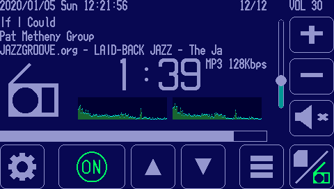
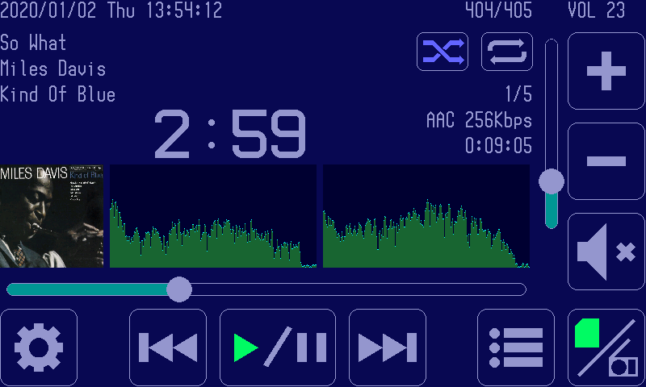
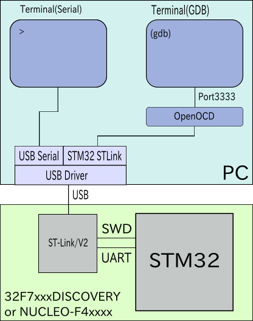

# GadgetSeed

---


GadgetSeedは組み込み機器向けのマルチタスクOSです。

## 特徴

* マルチタスクカーネル
* デバッグを支援するシェルコマンド
* 標準化されたデバイスドライバAPI
* [FatFS](http://elm-chan.org/fsw/ff/00index_e.html)ファイルシステムに対応
* [LwIP](https://savannah.nongnu.org/projects/lwip/) TCP/IPプロトコルスタックに対応
* グラフィックス描画、文字フォント描画

## サンプルアプリケーション

   インターネットラジオ、MP3プレーヤー等のサンプルアプリケーションを動作させることができます。

   以下の画像は32F746GDISCOVERYで動作するインターネットラジオプレーヤの画面スナップショットです。

   

   以下の画像は32F769IDISCOVERYで動作するMP3プレーヤの画面スナップショットです。

   

   他のサンプルアプリケーションについては、以下を参照してください。

   [apps/APPLICATIONS.jp.md](apps/APPLICATIONS.jp.md)

## サポートMCUアーキテクチャ

   GadgetSeed は以下のアーキテクチャで動作することができます。

* ARM Cortex-M7
* ARM Cortex-M4
* ARM Cortex-M3

## サポートハードウェア

   GadgetSeed は以下のハードウェアで動作することができます。

| ハードウェア                          | MCU           | アーキテクチャ |
|---------------------------------------|---------------|----------------|
| [32H747IDISCOVERY](#32H747IDISCOVERY) | STM32H747XIH6 | ARM Cortex-H7  |
| [32F769IDISCOVERY](#32F769IDISCOVERY) | STM32F769NIH6 | ARM Cortex-M7  |
| [32F746GDISCOVERY](#32F746GDISCOVERY) | STM32F746NGH6 | ARM Cortex-M7  |
| [32F469IDISCOVERY](#32F469IDISCOVERY) | STM32F469NIH6 | ARM Cortex-M4  |
| [NUCLEO-F411RE](#NUCLEO-F4x1RE)       | STM32F411RET6 | ARM Cortex-M4  |
| [NUCLEO-L152RE](#NUCLEO-L152RE)       | STM32L152RET6 | ARM Cortex-M3  |

<a name="32H747IDISCOVERY"></a>
### 32H747IDISCOVERY


<https://www.st.com/en/evaluation-tools/stm32h747i-disco.html>[English]  
<https://www.st.com/ja/evaluation-tools/stm32h747i-disco.html>[Japanese]

<a name="32F769IDISCOVERY"></a>
### 32F769IDISCOVERY


<https://www.st.com/en/evaluation-tools/32f769idiscovery.html>[English]  
<https://www.st.com/ja/evaluation-tools/32f769idiscovery.html>[Japanese]

<a name="32F746GDISCOVERY"></a>
### 32F746GDISCOVERY


<https://www.st.com/en/evaluation-tools/32f746gdiscovery.html>[English]  
<https://www.st.com/ja/evaluation-tools/32f746gdiscovery.html>[Japanese]

<a name="32F469IDISCOVERY"></a>
### 32F469IDISCOVERY


<https://www.st.com/en/evaluation-tools/32f469idiscovery.html>[English]  
<https://www.st.com/ja/evaluation-tools/32f469idiscovery.html>[Japanese]

<a name="NUCLEO-F4x1RE"></a>
### NUCLEO-F411RE


<https://www.st.com/en/evaluation-tools/nucleo-f411re.html>[English]  
<https://www.st.com/ja/evaluation-tools/nucleo-f411re.html>[Japanese]

<!-- NUCLEO-F401RE

<https://www.st.com/en/evaluation-tools/nucleo-f401re.html>[English]  
<https://www.st.com/ja/evaluation-tools/nucleo-f401re.html>[Japanese]
-->

<a name="NUCLEO-L152RE"></a>
### NUCLEO-L152RE


<https://www.st.com/en/evaluation-tools/nucleo-l152re.html>[English]  
<https://www.st.com/ja/evaluation-tools/nucleo-l152re.html>[Japanese]


## 開発環境の構築

### 動作環境構成

   

### Ubuntu 21.10の場合

1. STM32Cube HAL + LL Driversのインストール

   ディレクトリ"$HOME/STM32Cube/Repository"以下に、STMicroelectronicsのgithubよりSTM32Cube HAL + LLドライバをインストールします。

   ```sh
   mkdir -p ~/STM32Cube/Repository
   cd ~/STM32Cube/Repository
   git clone https://github.com/STMicroelectronics/STM32CubeH7.git
   git clone https://github.com/STMicroelectronics/STM32CubeF7.git
   git clone https://github.com/STMicroelectronics/STM32CubeF4.git
   git clone https://github.com/STMicroelectronics/STM32CubeL1.git
   ```

   GadgetSeedソースツリーに上記を実行するスクリプト(tools/install_hal.sh)があります。以下は実行例です。

   ```sh
   sh ./tools/install_hal.sh
   ```

1. arm-gccのインストール

   <https://developer.arm.com/open-source/gnu-toolchain/gnu-rm/downloads>

   上記サイトから GNU Arm Embedded Toolchain("gcc-arm-none-eabi-10-2020-q4-major-x86_64-linux.tar.bz2") をダウンロードしてください。

   インストール
   ```sh
   sudo tar xvfj gcc-arm-none-eabi-10-2020-q4-major-x86_64-linux.tar.bz2 -C /opt
   ```

   実行パスの設定
   ```sh
   PATH=$PATH:/opt/gcc-arm-none-eabi-10-2020-q4-major/bin
   ```
   上記は .bash_aliases 等に追記することを推奨します。

1. make gcc openocd picocom等ツールのインストール

   ```sh
   sudo apt install -y git make gcc unzip openocd picocom otf2bdf p7zip-full gawk libxml2-utils libncurses5
   ```

<!--
1. arm-gccのインストール
   <http://marksolters.com/programming/2016/06/22/arm-toolchain-16-04.html>

   ```sh
   sudo apt-get remove gcc-arm-none-eabi binutils
   sudo add-apt-repository ppa:team-gcc-arm-embedded/ppa
   sudo apt-get update
   sudo apt-get install gcc-arm-embedded
   ```
-->

<!--
1. STM32CubeProgrammer

   <http://www.st.com/en/development-tools/stm32cubeprog.html>[English]  
   <http://www.st.com/ja/development-tools/stm32cubeprog.html>[Japanese]

   必要に応じてインストールしてください。

   ```sh
   sudo apt-get -y install libusb-1.0.0-dev
   sudo ./SetupSTM32CubeProgrammer-1.0.0.linux
   sudo cp /usr/local/STMicroelectronics/STM32Cube/STM32CubeProgrammer/Drivers/rules/* /etc/udev/rules.d/
   ```
-->

## 実行ファイルのビルド

1. makeコマンドの実行

   ソースツリーを展開したディレクトリでmakeコマンドを実行してください。

   ```sh
   make
   ```

1. コンフィグレーションによるシステムの選択

   以下の内容が表示されたら、ビルドするシステムを選んでください。1から11の数値を入力してシステムを選択します。

   ```sh
   *** Select target system ***
     1 : 32F469IDISCOVERY               : STM 32F469IDISCOVERY                          : 32F469IDISCOVERY.conf
     2 : 32F746GDISCOVERY               : STM 32F746GDISCOVERY                          : 32F746GDISCOVERY.conf
     3 : 32F769IDISCOVERY               : STM 32F769IDISCOVERY                          : 32F769IDISCOVERY.conf
     4 : 32H747IDISCOVERY               : STM32H747I-DISCOVERY                          : 32H747IDISCOVERY.conf
     5 : NUCLEO-F411RE                  : STM NUCLEO-F411RE                             : NUCLEO-F411RE.conf
     6 : NUCLEO-F411RE_HVGA-LCD-HX8357D : STM NUCLEO-F411RE + MAR3520(HVGA LCD HX8357D) : NUCLEO-F411RE_HVGA-LCD-HX8357D.conf
     7 : NUCLEO-F411RE_QVGA-LCD-ILI9341 : STM NUCLEO-F411RE + K60(QVGA LCD ILI9341)     : NUCLEO-F411RE_QVGA-LCD-ILI9341.conf
     8 : NUCLEO-L152RE                  : STM NUCLEO-L152RE                             : NUCLEO-L152RE.conf
     9 : emu_hvga                       : Emulator system with linux HVGA(480x320)      : emu_hvga.conf
    10 : emu_qvga                       : Emulator system with linux QVGA(320x240)      : emu_qvga.conf
    11 : emu_wqvga                      : Emulator system with linux WQVGA(480x272)     : emu_wqvga.conf
    12 : emu_wvga                       : Emulator system with linux WVGA(800x480)      : emu_wvga.conf
   Input No. :
   ```

1. コンフィグレーションによるアプリケーションの選択

   以下のような内容が表示されたら、ビルドするアプリケーションを選んでください。
   例はシステムとして"3"(32F769IDISCOVERY)を選択した場合です。
   数値を入力してアプリケーションを選択します。

   ```sh
   Select : 3
   Target system : 32F769IDISCOVERY (32F769IDISCOVERY.conf)
   *** Select target apprication ***
     1 : Clock application                        : clock.conf
     2 : File manager high resolution display     : filemanager_hr.conf
     3 : Graphics object test                     : gobject_test.conf
     4 : Graphics test                            : graphics_test.conf
     5 : Graphics test(many fonts)                : graphics_test_many_fonts.conf
     6 : LED brink                                : heartbeat.conf
     7 : Hello world                              : hello_world.conf
     8 : Internet radio player high resolution display : internetradio_hr.conf
     9 : Music player high resolution display     : musicplay_hr.conf
    10 : Network sample                           : network.conf
    11 : NTP Clock application                    : ntp_clock.conf
    12 : Paint application                        : paint.conf
    13 : GUI(uilib) test high resolution display  : ui_test_hr.conf
   Input No. : 
   ```

   例はアプリケーションとして"8"(Internet radio player high resolution display)を選択した場合です。

   ```sh
   Select : 8
   Target apprication : Internet radio player high resolution display (internetradio_hr.conf)
   awk -f tools/mktargetconfig_mk.awk configs/systems/32F769IDISCOVERY.conf configs/internetradio_hr.conf > /Users/shudo/develop/gadgetseed/targetconfig.mk
   cp /Users/shudo/develop/gadgetseed/include/asm-Cortex-M7.h /Users/shudo/develop/gadgetseed/include/asm.h
   awk -f tools/mksysconfig_h.awk configs/systems/32F769IDISCOVERY.conf configs/internetradio_hr.conf > /Users/shudo/develop/gadgetseed/include/sysconfig.h
   arm-none-eabi-gcc -M -g -Wall -mthumb -mcpu=cortex-m7 -mtune=cortex-m7 -fipa-sra -mfpu=fpv5-d16 -mfloat-abi=hard -O2 -I/Users/shudo/develop/gadgetseed/include main.c > .depend
   arm-none-eabi-gcc -g -Wall -mthumb -mcpu=cortex-m7 -mtune=cortex-m7 -fipa-sra -mfpu=fpv5-d16 -mfloat-abi=hard -O2 -I/Users/shudo/develop/gadgetseed/include -c main.c
   make -C tools bmp2txt
   gcc -Wall -O2 -o bmp2txt bmp2txt.c
   tools/bmp2txt  gs_logo.bmp > gs_logo.txt
   make -C tools txt2bitmap
    :
    :
   arm-none-eabi-ranlib internetradio.a
   echo "const char os_version[] = \"0.9.10\";" > version.c
   echo "const char build_date[] = __DATE__;" >> version.c
   echo "const char build_time[] = __TIME__;" >> version.c
   arm-none-eabi-gcc -g -Wall -mthumb -mcpu=cortex-m7 -mtune=cortex-m7 -fipa-sra -mfpu=fpv5-d16 -mfloat-abi=hard -O2 -I/Users/shudo/develop/gadgetseed/include -c version.c
   arm-none-eabi-gcc -g -Wall -mthumb -mcpu=cortex-m7 -mtune=cortex-m7 -fipa-sra -mfpu=fpv5-d16 -mfloat-abi=hard -O2 -I/Users/shudo/develop/gadgetseed/include -Wl,-static -Wl,--gc-sections -nostartfiles -o gs-Cortex-M7-32F769IDISCOVERY-internetradio-0.9.10.elf -Tarch/Cortex-M7/systems/32F769IDISCOVERY.lds -Wl,-Map=gs-Cortex-M7-32F769IDISCOVERY-internetradio-0.9.10.map arch/Cortex-M7/start.o version.o \
   	main.o gs_logo.o apps/soundplay/soundplay.a apps/musicplay/musicplay.a apps/internetradio/internetradio.a shell/shell.a uilib/uilib.a extlibs/fatfs/libfatfs.a fs/fs.a graphics/graphics.a font/font.a fontdata/fontdata.a extlibs/lwip/liblwip.a net/net.a extlibs/libmad/libmad.a extlibs/faad2/libfaad2.a extlibs/picojpeg/libpicojpeg.a extlibs/libpng/libpng.a extlibs/zlib/libzlib.a kernel/kernel.a arch/Cortex-M7/arch.a drivers/drivers.a libs/libs.a kernel/task/task.a arch/Cortex-M7/arch.a -lm shell/shell.a uilib/uilib.a extlibs/fatfs/libfatfs.a fs/fs.a graphics/graphics.a font/font.a fontdata/fontdata.a extlibs/lwip/liblwip.a net/net.a extlibs/libmad/libmad.a extlibs/faad2/libfaad2.a extlibs/picojpeg/libpicojpeg.a extlibs/libpng/libpng.a extlibs/zlib/libzlib.a kernel/kernel.a arch/Cortex-M7/arch.a drivers/drivers.a libs/libs.a kernel/task/task.a
   ln -f -s gs-Cortex-M7-32F769IDISCOVERY-internetradio-0.9.10.elf gadgetseed
   arm-none-eabi-objdump -h -w --section=.VECTORS --section=.text --section=.rodata --section=.data \
   	--section=.bss --section=.stack --section=.extram --section=.qspirom gs-Cortex-M7-32F769IDISCOVERY-internetradio-0.9.10.elf
   
   gs-Cortex-M7-32F769IDISCOVERY-internetradio-0.9.10.elf:     file format elf32-littlearm
   
   Sections:
   Idx Name          Size      VMA       LMA       File off  Algn  Flags
     0 .VECTORS      000001f8  08000000  08000000  00010000  2**2  CONTENTS, ALLOC, LOAD, READONLY, DATA
     1 .text         000eeb74  08000200  08000200  00010200  2**6  CONTENTS, ALLOC, LOAD, READONLY, CODE
     3 .data         000042a4  20010000  080eed7c  00100000  2**3  CONTENTS, ALLOC, LOAD, DATA
     4 .bss          00046228  200142a8  080f3020  001042a8  2**3  ALLOC
     9 .stack        00000000  20006fa0  20006fa0  001b4e28  2**3  CONTENTS
    10 .extram       0099f204  c0000000  c0000000  001c0000  2**2  ALLOC
    11 .qspirom      000a4e28  90000000  90000000  00110000  2**2  CONTENTS, ALLOC, LOAD, READONLY, DATA
   arm-none-eabi-objcopy -O ihex -j .qspirom gs-Cortex-M7-32F769IDISCOVERY-internetradio-0.9.10.elf gs-Cortex-M7-32F769IDISCOVERY-internetradio-0.9.10-extrom.hex
   arm-none-eabi-objcopy -R .qspirom gs-Cortex-M7-32F769IDISCOVERY-internetradio-0.9.10.elf
   arm-none-eabi-objcopy: gs-Cortex-M7-32F769IDISCOVERY-internetradio-0.9.10.elf: warning: empty loadable segment detected at vaddr=0x90000000, is this intentional?
   ```

## ソフトウェアの書き込みと実行方法

   ビルドしたソフトウェアをハードウェアに書き込むためには openocd と GDB を使用します。
   デバッグコンソールを使用するにはシリアルターミナルを使用します。
   以下の例では、openocd と GDB とシリアルターミナル用にそれぞれターミナルを使用します。

1. openocd の起動

   openocdの為にターミナルを開き、ハードウェアに合わせて以下のコマンドを実行します。

   ### 32H747IDISCOVERY

   ```sh
   sudo openocd -f /usr/share/openocd/scripts/board/stm32h747i-disco.cfg
   ```

   ### 32F769IDISCOVERY

   ```sh
   sudo openocd -f /usr/share/openocd/scripts/board/stm32f769i-disco.cfg
   ```

   ### 32F746GDISCOVERY

   ```sh
   sudo openocd -f /usr/share/openocd/scripts/board/stm32f746g-disco.cfg
   ```

   ### 32F469IDISCOVERY

   ```sh
   sudo openocd -f /usr/share/openocd/scripts/board/stm32f469i-disco.cfg
   ```

   ### NUCLEO-F4xxxx

   ```sh
   sudo openocd -f /usr/share/openocd/scripts/board/st_nucleo_f4.cfg
   ```

   ### NUCLEO-L1xxxx

   ```sh
   sudo openocd -f /usr/share/openocd/scripts/board/st_nucleo_l1.cfg
   ```

   openocdは動作したままの状態になります。

1. シリアルターミナルの起動

   シリアルターミナルの為にターミナルを開き以下のコマンドを実行します。

   ### picocom を使用する場合

   ```sh
   sudo picocom -l /dev/ttyACM0 -b 115200
   ```

   ### cu を使用する場合

   ```sh
   sudo cu -l /dev/ttyACM0 -s 115200
   ```

1. QSPI-ROM へのデータ書き込み

   以下のアプリケーションを動作させるには予め QSPI-ROM にデータを書いておく必要があります。(下記のアプリケーション以外はこの作業は不要です。)

   * Internet radio player
   * Music player

   これらのアプリケーションはビルド後に "*-extrom.hex" の名称のファイルが作成されます。

   [STM32CubeProgrammer](https://www.st.com/ja/development-tools/stm32cubeprog.html)を使用して "*-extrom.hex" ファイルを QSPI-ROM に書き込みを行ってください。

1. GDB の起動

   GDBの為にターミナルを開き以下のコマンドを実行します。
   このコマンドは、 GadgetSeed をビルドしたディレクトリ以下で実行します。

   ```sh
   arm-none-eabi-gdb -x gdbinit-openocd gadgetseed
   ```

   上記のコマンドでハードウェアにビルドした GadgetSeed が書き込まれます。

   ```
   GNU gdb (GNU Arm Embedded Toolchain 10-2020-q4-major) 10.1.90.20201028-git
   Copyright (C) 2020 Free Software Foundation, Inc.
   License GPLv3+: GNU GPL version 3 or later <http://gnu.org/licenses/gpl.html>
   This is free software: you are free to change and redistribute it.
   There is NO WARRANTY, to the extent permitted by law.
   Type "show copying" and "show warranty" for details.
   This GDB was configured as "--host=x86_64-apple-darwin10 --target=arm-none-eabi".
   Type "show configuration" for configuration details.
   For bug reporting instructions, please see:
   <https://www.gnu.org/software/gdb/bugs/>.
   Find the GDB manual and other documentation resources online at:
       <http://www.gnu.org/software/gdb/documentation/>.
   
   For help, type "help".
   Type "apropos word" to search for commands related to "word"...
   Reading symbols from gadgetseed...
   start () at start.c:14
   14		init_sect();
   Previous state query failed, trying to reconnect
   Unable to match requested speed 2000 kHz, using 1800 kHz
   Unable to match requested speed 2000 kHz, using 1800 kHz
   target halted due to debug-request, current mode: Thread 
   xPSR: 0x01000000 pc: 0x08000200 msp: 0x20010000
   Loading section .VECTORS, size 0x1f8 lma 0x8000000
   Loading section .text, size 0xeeb74 lma 0x8000200
   Loading section .ARM.excep, size 0x8 lma 0x80eed74
   Loading section .data, size 0x42a4 lma 0x80eed7c
   Start address 0x08000200, load size 995352
   Transfer rate: 60 KB/sec, 14425 bytes/write.
   (gdb) 
   ```

   上記のようなメッセージが出力されます。
   プロンプト(gdb)が表示されるまで、数十秒の時間がかかります。

   以下のコマンドを入力して GadgetSeed を実行します。

   ```
   (gdb) c
   Continuing.
   ```

   GadgetSeed が起動し、シリアルターミナルに以下の表示が出力されます。

   ```
   GadgetSeed Ver. 0.9.10
   (c)2010-2021 Takashi SHUDO
   CPU ARCH     : Cortex-M7
   CPU NAME     : STM32F769NIH6
   SYSTEM       : 32F769IDISCOVERY
   Build date   : 10:22:29 Dec  5 2021
   Compiler     : 10.2.1 20201103 (release)
   STM32Cube HAL: FW.F7.1.16.0
   System Clock : 200 MHz
   GS Memory Alloc API is newlib API
   Heap area    : c099f204 - c0fffffc (6688248)
   6531 K byte free
   Graphics device "fb" Type : Frame buffer, Screen size 800x480(2), 16 bit color
   Storage 0: "sd"
   Set RTC Time = 1638668181.003
   RMII configuration Hardware Bug Version(0x1000)
   Touch sensor found
   MLAiC nAdkd rUepss ,: 0 2 00 010 000 007 69
   Mb/s, Half
   DHCP Start
   : 
   ```

   シリアルターミナルはコマンドシェルとして各コマンドを入力することができます。
   コマンドシェルについては、以下を参照してください。

   [shell/SHELL.jp.md](shell/SHELL.jp.md)

# PC Linux(Ubuntu)上での実行

PC Linux上で、GadgetSeed のエミュレータを実行することができます。
GadgeSeedのエミュレータは実験的な実装です。動作に不安定なところがあります。
以下のコマンドで、エミュレータのビルドに必要なパッケージをインストールします。

```sh
sudo apt install -y ncurses-dev libasound2-dev aptitude
sudo aptitude install -y libgtk2.0-dev
```

## コンフィグレーションとビルド

エミュレータを実行すにはコンフィグレーションでシステムを選択するときに時に "emu" を選択します。
以下のコマンドで再度コンフィグレーションから GadgetSeed をビルドすることができます。

```sh
make reset
make
```

## 実行

以下のコマンドで、GadgetSeed のエミュレータを実行することができます。

```sh
./gadgetseed
```

# ドキュメント

以下のコマンドで GadgetSeed のドキュメントを作成することができます。

```sh
make docs
```

以下に Doxygen ドキュメントファイルが生成されます。

[docs/html/index.html](docs/html/index.html)

システムの構築や、アプリケーションの開発の為のコンフィグレーション項目は以下を参照して下さい。

[configs/CONFIG.jp.md](configs/CONFIG.jp.md)

# ライセンス

[MIT](LICENSE.txt)

# 著者

Takashi SHUDO([takashi.shudo@nifty.com](mailto:takashi.shudo@nifty.com))
