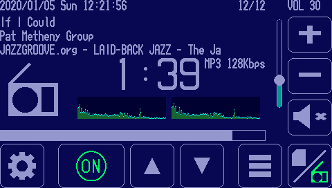
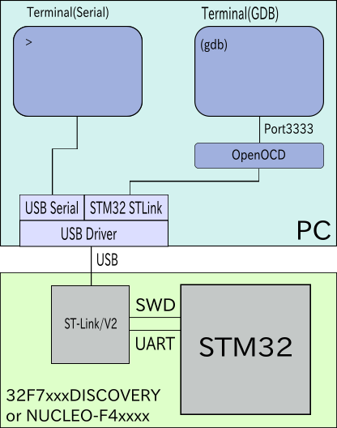

# GadgetSeed

---


GadgetSeed is a multitasking OS for embedded devices.

## feature

* Multitasking kernel
* Shell commands to help with debugging
* Standardized device driver API
* [FatFS](http://elm-chan.org/fsw/ff/00index_e.html) Supports file system
* [LwIP](https://savannah.nongnu.org/projects/lwip/) TCP/IP Supports protocol stack
* Graphics drawing, character font drawing

## Sample application

   You can run sample applications such as Internet radio and MP3 players.

   The image below is a screen snapshot of an internet radio player running on the 32F746GDISCOVERY.

   

   The image below is a screen snapshot of an MP3 player running on the 32F769IDISCOVERY.

   

   See below for other sample applications.

   [apps/APPLICATIONS.md](apps/APPLICATIONS.md)

## Support MCU architecture

   GadgetSeed can work with the following architectures:

* ARM Cortex-M7
* ARM Cortex-M4
* ARM Cortex-M3

## Support hardware

   GadgetSeed can run on the following hardware:

| Hardware | MCU | Architecture |
|---------------------------------------|---------------|----------------|
| [32H747IDISCOVERY](#32H747IDISCOVERY) | STM32H747XIH6 | ARM Cortex-H7  |
| [32F769IDISCOVERY](#32F769IDISCOVERY) | STM32F769NIH6 | ARM Cortex-M7  |
| [32F746GDISCOVERY](#32F746GDISCOVERY) | STM32F746NGH6 | ARM Cortex-M7  |
| [32F469IDISCOVERY](#32F469IDISCOVERY) | STM32F469NIH6 | ARM Cortex-M4  |
| [NUCLEO-F411RE](#NUCLEO-F4x1RE)       | STM32F411RET6 | ARM Cortex-M4  |
| [NUCLEO-L152RE](#NUCLEO-L152RE)       | STM32L152RET6 | ARM Cortex-M3  |

<a name="32H747IDISCOVERY"></a>
### 32H747IDISCOVERY


<https://www.st.com/en/evaluation-tools/stm32h747i-disco.html>[English]  
<https://www.st.com/ja/evaluation-tools/stm32h747i-disco.html>[Japanese]

<a name="32F769IDISCOVERY"></a>
### 32F769IDISCOVERY


<https://www.st.com/en/evaluation-tools/32f769idiscovery.html>[English]  
<https://www.st.com/ja/evaluation-tools/32f769idiscovery.html>[Japanese]

<a name="32F746GDISCOVERY"></a>
### 32F746GDISCOVERY


<https://www.st.com/en/evaluation-tools/32f746gdiscovery.html>[English]  
<https://www.st.com/ja/evaluation-tools/32f746gdiscovery.html>[Japanese]

<a name="32F469IDISCOVERY"></a>
### 32F469IDISCOVERY


<https://www.st.com/en/evaluation-tools/32f469idiscovery.html>[English]  
<https://www.st.com/ja/evaluation-tools/32f469idiscovery.html>[Japanese]

<a name="NUCLEO-F4x1RE"></a>
### NUCLEO-F411RE


<https://www.st.com/en/evaluation-tools/nucleo-f411re.html>[English]  
<https://www.st.com/ja/evaluation-tools/nucleo-f411re.html>[Japanese]

<!-- NUCLEO-F401RE

<https://www.st.com/en/evaluation-tools/nucleo-f401re.html>[English]  
<https://www.st.com/ja/evaluation-tools/nucleo-f401re.html>[Japanese]
-->

<a name="NUCLEO-L152RE"></a>
### NUCLEO-L152RE


<https://www.st.com/en/evaluation-tools/nucleo-l152re.html>[English]  
<https://www.st.com/ja/evaluation-tools/nucleo-l152re.html>[Japanese]


## Building a development environment

### Operating environment configuration

   

### For Ubuntu 20.04

1. Install STM32Cube HAL + LL Drivers

   Install the STM32Cube HAL + LL driver from STMicroelectronics' github under the directory "$ HOME / STM32Cube / Repository".

   ```sh
   mkdir -p ~/STM32Cube/Repository
   cd ~/STM32Cube/Repository
   git clone https://github.com/STMicroelectronics/STM32CubeH7.git
   git clone https://github.com/STMicroelectronics/STM32CubeF7.git
   git clone https://github.com/STMicroelectronics/STM32CubeF4.git
   git clone https://github.com/STMicroelectronics/STM32CubeL1.git
   ```

   There is a script (tools / install_hal.sh) that does the above in the GadgetSeed source tree. The following is an execution example.

   ```sh
   sh ./tools/install_hal.sh
   ```

1. Install arm-gcc

   <https://developer.arm.com/open-source/gnu-toolchain/gnu-rm/downloads>

   Download the GNU Arm Embedded Toolchain ("gcc-arm-none-eabi-10-2020-q4-major-x86_64-linux.tar.bz2") from the above site.

   install
   ```sh
   sudo tar xvfj gcc-arm-none-eabi-10-2020-q4-major-x86_64-linux.tar.bz2 -C /opt
   ```

   Execution path setting
   ```sh
   PATH=$PATH:/opt/gcc-arm-none-eabi-10-2020-q4-major/bin
   ```
   It is recommended to add the above to .bash_aliases etc.

1. Install tools such as make gcc openocd picocom

   ```sh
   sudo apt install -y git make gcc unzip openocd picocom otf2bdf p7zip-full gawk
   ```

<!--
1. Install arm-gcc
   <http://marksolters.com/programming/2016/06/22/arm-toolchain-16-04.html>

   ```sh
   sudo apt-get remove gcc-arm-none-eabi binutils
   sudo add-apt-repository ppa:team-gcc-arm-embedded/ppa
   sudo apt-get update
   sudo apt-get install gcc-arm-embedded
   ```
-->

<!--
1. STM32CubeProgrammer

   <http://www.st.com/en/development-tools/stm32cubeprog.html>[English]  
   <http://www.st.com/ja/development-tools/stm32cubeprog.html>[Japanese]

   Please install if necessary.

   ```sh
   sudo apt-get -y install libusb-1.0.0-dev
   sudo ./SetupSTM32CubeProgrammer-1.0.0.linux
   sudo cp /usr/local/STMicroelectronics/STM32Cube/STM32CubeProgrammer/Drivers/rules/* /etc/udev/rules.d/
   ```
-->

## Executable build

1. Execute the make command

   Execute the make command in the directory where you extracted the source tree.

   ```sh
   make
   ```

1. System selection by configuration

   When the following content is displayed, select the system to build. Enter a number from 1 to 11 to select your system.

   ```sh
   *** Select target system ***
     1 : 32F469IDISCOVERY               : STM 32F469IDISCOVERY                          : 32F469IDISCOVERY.conf
     2 : 32F746GDISCOVERY               : STM 32F746GDISCOVERY                          : 32F746GDISCOVERY.conf
     3 : 32F769IDISCOVERY               : STM 32F769IDISCOVERY                          : 32F769IDISCOVERY.conf
     4 : NUCLEO-F411RE                  : STM NUCLEO-F411RE                             : NUCLEO-F411RE.conf
     5 : NUCLEO-F411RE_HVGA-LCD-HX8357D : STM NUCLEO-F411RE + MAR3520(HVGA LCD HX8357D) : NUCLEO-F411RE_HVGA-LCD-HX8357D.conf
     6 : NUCLEO-F411RE_QVGA-LCD-ILI9341 : STM NUCLEO-F411RE + K60(QVGA LCD ILI9341)     : NUCLEO-F411RE_QVGA-LCD-ILI9341.conf
     7 : NUCLEO-L152RE                  : STM NUCLEO-L152RE                             : NUCLEO-L152RE.conf
     8 : emu_hvga                       : Emulator system with linux HVGA(480x320)      : emu_hvga.conf
     9 : emu_qvga                       : Emulator system with linux QVGA(320x240)      : emu_qvga.conf
    10 : emu_wqvga                      : Emulator system with linux WQVGA(480x272)     : emu_wqvga.conf
    11 : emu_wvga                       : Emulator system with linux WVGA(800x480)      : emu_wvga.conf
   Input No. : 
   ```

1. Application selection by configuration

   When the following content is displayed, select the application to build.
   An example is when "3" (32F769IDISCOVERY) is selected as the system.
   Enter a number to select the application.

   ```sh
   Select : 3
   Target system : 32F769IDISCOVERY (32F769IDISCOVERY.conf)
   *** Select target apprication ***
     1 : Clock application                        : clock.conf
     2 : File manager high resolution display     : filemanager_hr.conf
     3 : Graphics object test                     : gobject_test.conf
     4 : Graphics test                            : graphics_test.conf
     5 : Graphics test(many fonts)                : graphics_test_many_fonts.conf
     6 : LED brink                                : heartbeat.conf
     7 : Hello world                              : hello_world.conf
     8 : Internet radio player high resolution display : internetradio_hr.conf
     9 : Music player high resolution display     : musicplay_hr.conf
    10 : Network sample                           : network.conf
    11 : NTP Clock application                    : ntp_clock.conf
    12 : Paint application                        : paint.conf
    13 : GUI(uilib) test high resolution display  : ui_test_hr.conf
   Input No. : 
   ```

   An example is when "8" (Internet radio player high resolution display) is selected as the application.

   ```sh
   Select : 8
   Target apprication : Internet radio player high resolution display (internetradio_hr.conf)
   awk -f tools/mktargetconfig_mk.awk configs/systems/32F769IDISCOVERY.conf configs/internetradio_hr.conf > /Users/shudo/develop/gadgetseed/targetconfig.mk
   cp /Users/shudo/develop/gadgetseed/include/asm-Cortex-M7.h /Users/shudo/develop/gadgetseed/include/asm.h
   awk -f tools/mksysconfig_h.awk configs/systems/32F769IDISCOVERY.conf configs/internetradio_hr.conf > /Users/shudo/develop/gadgetseed/include/sysconfig.h
   arm-none-eabi-gcc -M -g -Wall -mthumb -mcpu=cortex-m7 -mtune=cortex-m7 -fipa-sra -mfpu=fpv5-d16 -mfloat-abi=hard -O2 -I/Users/shudo/develop/gadgetseed/include main.c > .depend
   arm-none-eabi-gcc -g -Wall -mthumb -mcpu=cortex-m7 -mtune=cortex-m7 -fipa-sra -mfpu=fpv5-d16 -mfloat-abi=hard -O2 -I/Users/shudo/develop/gadgetseed/include -c main.c
   make -C tools bmp2txt
   gcc -Wall -O2 -o bmp2txt bmp2txt.c
   tools/bmp2txt  gs_logo.bmp > gs_logo.txt
   make -C tools txt2bitmap
    :
    :
   arm-none-eabi-ranlib internetradio.a
   echo "const char os_version[] = \"0.9.9\";" > version.c
   echo "const char build_date[] = __DATE__;" >> version.c
   echo "const char build_time[] = __TIME__;" >> version.c
   arm-none-eabi-gcc -g -Wall -mthumb -mcpu=cortex-m7 -mtune=cortex-m7 -fipa-sra -mfpu=fpv5-d16 -mfloat-abi=hard -O2 -I/Users/shudo/develop/gadgetseed/include -c version.c
   arm-none-eabi-gcc -g -Wall -mthumb -mcpu=cortex-m7 -mtune=cortex-m7 -fipa-sra -mfpu=fpv5-d16 -mfloat-abi=hard -O2 -I/Users/shudo/develop/gadgetseed/include -Wl,-static -Wl,--gc-sections -nostartfiles -o gs-Cortex-M7-32F769IDISCOVERY-internetradio-0.9.9.elf -Tarch/Cortex-M7/systems/32F769IDISCOVERY.lds -Wl,-Map=gs-Cortex-M7-32F769IDISCOVERY-internetradio-0.9.9.map arch/Cortex-M7/start.o version.o \
   	main.o gs_logo.o apps/soundplay/soundplay.a apps/musicplay/musicplay.a apps/internetradio/internetradio.a shell/shell.a uilib/uilib.a extlibs/fatfs/libfatfs.a fs/fs.a graphics/graphics.a font/font.a fontdata/fontdata.a extlibs/lwip/liblwip.a net/net.a extlibs/libmad/libmad.a extlibs/faad2/libfaad2.a extlibs/picojpeg/libpicojpeg.a extlibs/libpng/libpng.a extlibs/zlib/libzlib.a kernel/kernel.a arch/Cortex-M7/arch.a drivers/drivers.a libs/libs.a kernel/task/task.a arch/Cortex-M7/arch.a -lm shell/shell.a uilib/uilib.a extlibs/fatfs/libfatfs.a fs/fs.a graphics/graphics.a font/font.a fontdata/fontdata.a extlibs/lwip/liblwip.a net/net.a extlibs/libmad/libmad.a extlibs/faad2/libfaad2.a extlibs/picojpeg/libpicojpeg.a extlibs/libpng/libpng.a extlibs/zlib/libzlib.a kernel/kernel.a arch/Cortex-M7/arch.a drivers/drivers.a libs/libs.a kernel/task/task.a
   ln -f -s gs-Cortex-M7-32F769IDISCOVERY-internetradio-0.9.9.elf gadgetseed
   arm-none-eabi-objdump -h -w --section=.VECTORS --section=.text --section=.rodata --section=.data \
	--section=.bss --section=.stack --section=.extram --section=.qspirom gs-Cortex-M7-32F769IDISCOVERY-internetradio-0.9.9.elf

   gs-Cortex-M7-32F769IDISCOVERY-internetradio-0.9.9.elf:     file format elf32-littlearm

   Sections:
   Idx Name          Size      VMA       LMA       File off  Algn  Flags
     0 .VECTORS      000001f8  08000000  08000000  00010000  2**2  CONTENTS, ALLOC, LOAD, READONLY, DATA
     1 .text         000e975c  08000200  08000200  00010200  2**6  CONTENTS, ALLOC, LOAD, READONLY, CODE
     3 .data         00004294  20010000  080e9964  00100000  2**3  CONTENTS, ALLOC, LOAD, DATA
     4 .bss          00043d68  20014298  080edc00  00104298  2**3  ALLOC
     9 .stack        00000000  20006fa0  20006fa0  001b4e28  2**3  CONTENTS
    10 .extram       0099f204  c0000000  c0000000  001c0000  2**2  ALLOC
    11 .qspirom      000a4e28  90000000  90000000  00110000  2**2  CONTENTS, ALLOC, LOAD, READONLY, DATA
   arm-none-eabi-objcopy -O ihex -j .qspirom gs-Cortex-M7-32F769IDISCOVERY-internetradio-0.9.9.elf gs-Cortex-M7-32F769IDISCOVERY-internetradio-0.9.9-extrom.hex
   arm-none-eabi-objcopy -R .qspirom gs-Cortex-M7-32F769IDISCOVERY-internetradio-0.9.9.elf
   arm-none-eabi-objcopy: gs-Cortex-M7-32F769IDISCOVERY-internetradio-0.9.9.elf: warning: empty loadable segment detected at vaddr=0x90000000, is this intentional?
   ```

## How to write and execute software

   Use openocd and GDB to write the built software to the hardware.
   Use a serial terminal to use the debug console.
   The following example uses terminals for openocd, GDB, and serial terminals, respectively.

1. Start openocd

   Open a terminal for openocd and execute the following command according to the hardware.

   ### 32F7xxxDISCOVERY

   ```sh
   sudo openocd -f /usr/share/openocd/scripts/board/stm32f7discovery.cfg
   ```

   ### 32F469IDISCOVERY

   ```sh
   sudo openocd -f /usr/share/openocd/scripts/board/stm32f469discovery.cfg
   ```

   ### NUCLEO-F4xxxx

   ```sh
   sudo openocd -f /usr/share/openocd/scripts/board/st_nucleo_f4.cfg
   ```

   ### NUCLEO-L1xxxx

   ```sh
   sudo openocd -f /usr/share/openocd/scripts/board/st_nucleo_l1.cfg
   ```

   openocd will remain working.

1. Start the serial terminal

   Open a terminal for the serial terminal and execute the following command.

   ### When using picocom

   ```sh
   sudo picocom -l /dev/ttyACM0 -b 115200
   ```

   ### When using cu

   ```sh
   sudo cu -l /dev/ttyACM0 -s 115200
   ```

1. Write data to QSPI-ROM

   It is necessary to write the data in QSPI-ROM in advance to operate the following applications. (This work is not necessary except for the following applications.)

   * Internet radio player
   * Music player

   After building these applications, a file named "* -extrom.hex" will be created.

   Write the "* -extrom.hex" file to QSPI-ROM using [STM32 ST-LINK Utility](https://www.st.com/en/development-tools/stsw-link004.html) please.

   At the moment the STM32 ST-LINK Utility seems to work only on Windows OS. Therefore, you need a Windows PC to do this.

1. Start GDB

   Open a terminal for GDB and execute the following command.
   Run this command under the directory where you built GadgetSeed.

   ```sh
   arm-none-eabi-gdb -x gdbinit-openocd gadgetseed
   ```

   The above command will write the GadgetSeed built to the hardware.

   ```
   GNU gdb (GNU Tools for Arm Embedded Processors 8-2018-q4-major) 8.2.50.20181213-git
   Copyright (C) 2018 Free Software Foundation, Inc.
   License GPLv3+: GNU GPL version 3 or later <http://gnu.org/licenses/gpl.html>
   This is free software: you are free to change and redistribute it.
   There is NO WARRANTY, to the extent permitted by law.
   Type "show copying" and "show warranty" for details.
   This GDB was configured as "--host=x86_64-apple-darwin10 --target=arm-none-eabi".
   Type "show configuration" for configuration details.
   For bug reporting instructions, please see:
   <http://www.gnu.org/software/gdb/bugs/>.
   Find the GDB manual and other documentation resources online at:
       <http://www.gnu.org/software/gdb/documentation/>.

   For help, type "help".
   Type "apropos word" to search for commands related to "word"...
   Reading symbols from gadgetseed...
   0x00000000 in ?? ()
   target halted due to debug-request, current mode: Thread 
   xPSR: 0x01000000 pc: 0x08000200 msp: 0x20010000
   Loading section .VECTORS, size 0x1f8 lma 0x8000000
   Loading section .text, size 0xe975c lma 0x8000200
   Loading section .ARM.excep, size 0x8 lma 0x80e995c
   Loading section .data, size 0x4294 lma 0x80e9964
   Start address 0x8000200, load size 973808
   Transfer rate: 47 KB/sec, 14534 bytes/write.
   (gdb) 
   ```

   A message like the one above will be output.
   It takes tens of seconds for the prompt (gdb) to appear.

   Run GadgetSeed by typing the following command:

   ```
   (gdb) c
   Continuing.
   ```

   GadgetSeed will start and the following display will be output to the serial terminal.

   ```
   GadgetSeed Ver. 0.9.9
   (c)2010-2020 Takashi SHUDO
   CPU ARCH     : Cortex-M7
   CPU NAME     : STM32F769NIH6
   SYSTEM       : 32F769IDISCOVERY
   Build date   : 19:44:27 Jan  2 2020
   Compiler     : 8.2.1 20181213 (release) [gcc-8-branch revision 267074]
   STM32Cube HAL: FW.F7.1.15.0
   System Clock : 200 MHz
   GS Memory Alloc API is newlib API
   Heap area    : c099f204 - c0fffffc (6688248)
   6531 K byte free
   Graphics device "fb" Type : Frame buffer, Screen size 800x480(2), 16 bit color
   Storage 0: "sd"
   Set RTC Time = 946684800.011
   RMII configuration Hardware Bug Version(0x1000)
   Touch sensor found
   MAC Address : 02 00 00 00 07 69
   Link Down, 100Mb/s, Half
   : 
   ```

   The serial terminal can enter each command as a command shell.
   See below for the command shell.

   [shell/SHELL.md](shell/SHELL.md)

# Running on PC Linux (Ubuntu)

You can run the GadgetSeed emulator on PC Linux.
The GadgeSeed emulator is an experimental implementation. There is an unstable part in the operation.
Install the packages required to build the emulator with the following command.

```sh
sudo apt install -y ncurses-dev libasound2-dev aptitude
sudo aptitude install -y libgtk2.0-dev
```

## Configuration and build

To run the emulator, select "emu" when selecting the system in the configuration.
You can build GadgetSeed from the configuration again with the following command.

```sh
make reset
make
```

## execution

You can run the GadgetSeed emulator with the following command.

```sh
./gadgetseed
```

# document

You can create a GadgetSeed document with the following command:

```sh
make docs
```

The Doxygen document file will be generated below.

[docs/html/index.html](docs/html/index.html)

Please refer to the following for configuration items for system construction and application development.

[configs/CONFIG.md](configs/CONFIG.md)

# license

[MIT](LICENSE.txt)

# author

Takashi SHUDO([takashi.shudo@nifty.com](mailto:takashi.shudo@nifty.com))
