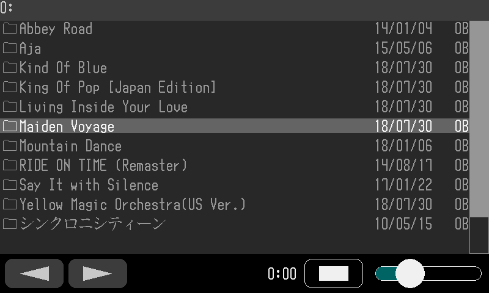
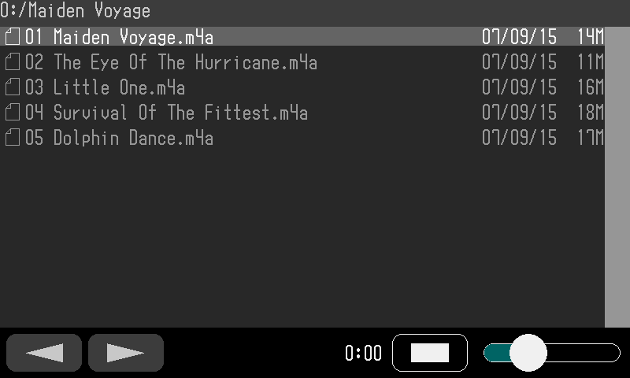
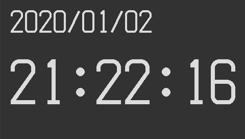
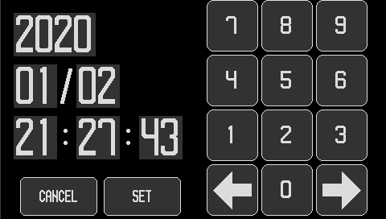
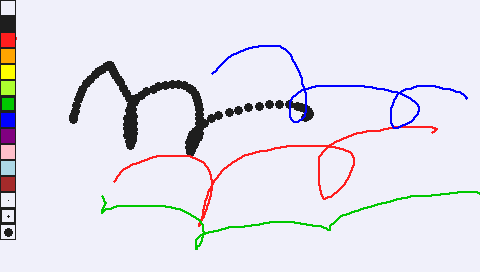

# GadgetSeed サンプルアプリケーション

## Internet radio/Music player

   タッチパネルで操作する音楽プレーヤーです。

   [shoutcast](https://directory.shoutcast.com/)のインターネットラジオを再生できます。
   MicroSDカードに保存されたM3U、PLSファイルはインターネットラジオのプレイリストとして再生することができます。(MP3,128Kbpsのみ)

   MicroSDカードに保存されたMP3ファイル、AACファイルを再生できます。

   アルバムアートを含めた楽曲の情報を表示できます。

   AACオーディオデコーダに [faad2](https://github.com/dsvensson/faad2) を使用しています。

   MP3オーディオデコーダに [libmad](https://www.underbit.com/products/mad/) を使用しています。

   JPEGとPNGフォーマットのアルバムアートを表示することができます。

   JPEG画像のデコードに [picojpeg](https://code.google.com/archive/p/picojpeg/) を使用しています。

   PNG画像コーデックに [libpng](http://www.libpng.org/pub/png/) と [zlib](https://zlib.net/) を使用しています。

   ランダム再生機能の乱数発生に [mt19937ar](http://www.math.sci.hiroshima-u.ac.jp/~m-mat/MT/MT2002/mt19937ar.html) を使用しています。

   32F769IDISCOVERY、32F746GDISCOVERYで動作します。

   

   スナップショットは 32F769IDISCOVERY のものです。

   コンフィグファイル : internetradio_hr.conf, internetradio_lr.conf

   ソースファイルディレクトリ : internetradio, soundplay, musicplay

## File manager

   シンプルなファイルマネージャです。MP3､AACファイルを再生できます。(32F769IDISCOVERY、32F746GDISCOVERYのみ)

   PNG画像ファイルを表示できます。(32F769IDISCOVERY、32F746GDISCOVERYのみ)

   JPEG画像ファイルを表示できます。

   32F769IDISCOVERY、32F746GDISCOVERYで動作します。

   NUCLEO-F411RE + LCD(Kuman 2.8inch TFT LCD Shield)で動作します。

   NUCLEO-F411RE + LCD(Kuman 3.5inch TFT LCD Shield)で動作します。

   

   

   スナップショットは 32F769IDISCOVERY のものです。

   コンフィグファイル : filemanager_hr.conf, filemanager_lr.conf

   ソースファイルディレクトリ : filemanager, soundplay

## Clock application

   RTCを使用したデジタル時計のアプリケーションです。

   

   

   スナップショットは 32F746GDISCOVERY のものです。

   コンフィグファイル : clock_hr.conf

   ソースファイルディレクトリ : clock

## Paint application

   タッチパネルを使用したシンプルなお絵かきソフトです。

   

   スナップショットは 32F746GDISCOVERY のものです。

   コンフィグファイル : paint.conf

   ソースファイルディレクトリ : paint

## Graphics test

   ランダムなグラフィック描画テストプログラムです。

   

   スナップショットは NUCLEO-F411RE + LCD(Kuman 2.8inch TFT LCD Shield)のものです。

   コンフィグファイル : graphics_test.conf

   ソースファイルディレクトリ : graphics_test

## LED brink

   LEDを点滅させるアプリケーションです。
   ボードに搭載されているLCDを点滅させます。

   32F769IDISCOVERY、NUCLEO-F411RE で動作します。

   コンフィグファイル : heartbeat.conf

   ソースファイルディレクトリ : heartbeat

## Hello world

   デバッグコンソールへ"Hello, word!"を表示します。

   ```sh
   GadgetSeed Ver. 0.9.5
   (c)2010-2018 Takashi SHUDO
   CPU ARCH     : Cortex-M7
   CPU NAME     : STM32F746NGH6
   SYSTEM       : 32F746GDISCOVERY
   Build date   : 15:52:32 Jul 31 2018
   System Clock : 162 MHz
   : Hello, world!
   ```

   コンフィグファイル : hello_world.conf

   ソースファイルディレクトリ : hello_world

## Network sample

   LwIPのサンプルである HTTPSERVER が動作します。また、 telnetd が動作します。
   外部から telnet でログインし GadgetSeed のデバッグコンソールを使用することができます。

   32F769IDISCOVERY、32F746GDISCOVERYで動作します。

   コンフィグファイル : network.conf

   ソースファイルディレクトリ : httpserver, telnetd
