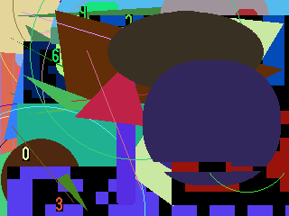

# GadgetSeed サンプルアプリケーション

## Music player

   タッチパネルで操作する音楽プレーヤーです。
   MP3ファイル、AACファイルを再生できます。
   アルバムアートを含めた楽曲の情報を表示できます。

   32F769IDISCOVERY、32F746GDISCOVERYで動作します。

   

   スナップショットは 32F769IDISCOVERY のものです。

## File manager

   シンプルなファイルマネージャです。MP3､AACファイルを再生できます。(32F769IDISCOVERY、32F746GDISCOVERYのみ)

   PNG画像ファイルを表示できます。(32F769IDISCOVERY、32F746GDISCOVERYのみ)

   JPEG画像ファイルを表示できます。

   32F769IDISCOVERY、32F746GDISCOVERYで動作します。

   NUCLEO-F411RE + LCD(Kuman 2.8inch TFT LCD Shield)で動作します。

   NUCLEO-F411RE + LCD(Kuman 3.5inch TFT LCD Shield)で動作します。

   

   

   スナップショットは 32F769IDISCOVERY のものです。

## Clock application

   RTCを使用したデジタル時計のアプリケーションです。

   

   

   スナップショットは 32F746GDISCOVERY のものです。

## Paint application

   タッチパネルを使用したシンプルなお絵かきソフトです。

   

   スナップショットは 32F746GDISCOVERY のものです。

## Graphics test

   ランダムなグラフィック描画テストプログラムです。

   

   スナップショットは NUCLEO-F411RE + LCD(Kuman 2.8inch TFT LCD Shield)のものです。

## LED brink

   LEDを点滅させるアプリケーションです。
   ボードに搭載されているLCDを点滅させます。

   32F769IDISCOVERY、NUCLEO-F411RE で動作します。

## Hello world

   デバッグコンソールへ"Hello, word!"を表示します。

   ```sh
   GadgetSeed Ver. 0.94
   (c)2010-2018 Takashi SHUDO
   CPU ARCH     : Cortex-M7
   CPU NAME     : STM32F746NGH6
   SYSTEM       : 32F746GDISCOVERY
   Build date   : 15:52:32 Jul 31 2018
   System Clock : 162 MHz
   : Hello, world!
   ```

## Network sample

   LwIPのサンプルである HTTPSERVER が動作します。また、 telnetd が動作します。
   外部から telnet でログインし GadgetSeed のデバッグコンソールを使用することができます。

   32F769IDISCOVERY、32F746GDISCOVERYで動作します。
