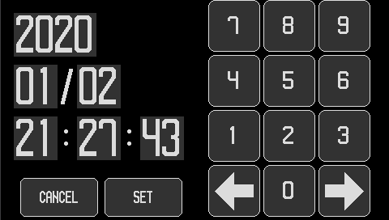

# GadgetSeed sample application

## Internet radio/Music player

   A music player operated with a touch panel.

   You can play Internet radio on [shoutcast](https://directory.shoutcast.com/).
   M3U and PLS files saved on the MicroSD card can be played as playlists on Internet radio. (MP3, 128Kbps only)

   You can play MP3 files and AAC files saved on the MicroSD card.

   You can display music information including album art.

   I am using [faad2](https://github.com/dsvensson/faad2) for my AAC audio decoder.

   I'm using [libmad](https://www.underbit.com/products/mad/) for my MP3 audio decoder.

   You can view album art in JPEG and PNG formats.

   I am using [picojpeg](https://code.google.com/archive/p/picojpeg/) to decode JPEG images.

   I am using [libpng](http://www.libpng.org/pub/png/) and [zlib](https://zlib.net/) for the PNG image codec.

   [Mt19937ar](http://www.math.sci.hiroshima-u.ac.jp/~m-mat/MT/MT2002/emt19937ar.html) is used to generate random numbers for the random playback function.

   Works with 32F769IDISCOVERY and 32F746GDISCOVERY.

   

   The snapshot is from 32F769IDISCOVERY.

   Configuration files: internetradio_hr.conf, internetradio_lr.conf

   Source file directory: internetradio, soundplay, musicplay

## File manager

   A simple file manager. You can play MP3 and AAC files. (32F769IDISCOVERY, 32F746GDISCOVERY only)

   You can view PNG image files. (32F769IDISCOVERY, 32F746GDISCOVERY only)

   You can view JPEG image files.

   Works with 32F769IDISCOVERY and 32F746GDISCOVERY.

   Works with NUCLEO-F411RE + LCD (Kuman 2.8inch TFT LCD Shield).

   Works with NUCLEO-F411RE + LCD (Kuman 3.5inch TFT LCD Shield).

   

   

   The snapshot is from 32F769IDISCOVERY.

   Configuration files: filemanager_hr.conf, filemanager_lr.conf

   Source file directory: filemanager, soundplay

## Clock application

   It is an application of digital clock using RTC.

   

   

   The snapshot is from 32F746GDISCOVERY.

   Configuration file: clock_hr.conf

   Source file directory: clock

## Paint application

   It is a simple drawing software that uses a touch panel.

   

   The snapshot is from 32F746GDISCOVERY.

   Config file: paint.conf

   Source file directory: paint

## Graphics test

   Random graphic drawing test program.

   

   The snapshot is from NUCLEO-F411RE + LCD (Kuman 2.8inch TFT LCD Shield).

   Configuration file: graphics_test.conf

   Source file directory: graphics_test

## LED brink

   It is an application that blinks the LED.
   Blinks the LCD mounted on the board.

   Works with 32F769IDISCOVERY and NUCLEO-F411RE.

   Config file: heartbeat.conf

   Source file directory: heartbeat

## Hello world

   Display "Hello, world!" In the debug console.

   ```sh
   GadgetSeed Ver. 0.9.5
   (c)2010-2018 Takashi SHUDO
   CPU ARCH     : Cortex-M7
   CPU NAME     : STM32F746NGH6
   SYSTEM       : 32F746GDISCOVERY
   Build date   : 15:52:32 Jul 31 2018
   System Clock : 162 MHz
   : Hello, world!
   ```

   Configuration file: hello_world.conf

   Source file directory: hello_world

## Network sample

   HTTPSERVER, which is a sample of LwIP, works. Also, telnetd works.
   You can telnet from outside and use GadgetSeed's debug console.

   Works with 32F769IDISCOVERY and 32F746GDISCOVERY.

   Config file: network.conf

   Source file directory: httpserver, telnetd
