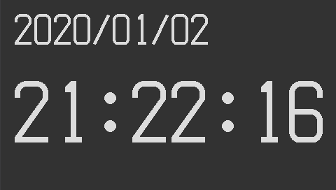

# Gadgetseed Sample Application

## Music player

   It is a music player operated by Touch panel.
   You can play MP3 and AAC files.
   You can view music information, including album art.

   32F769IDISCOVERY, operating at 32F746GDISCOVERY.

   

   The snapshot is 32F769IDISCOVERY.

## File manager

   A simple file Manager. You can play MP3 ､ AAC files. (32F769IDISCOVERY, 32F746GDISCOVERY only)

   You can view PNG image files. (32F769IDISCOVERY, 32F746GDISCOVERY only)

   You can view the JPEG image file.

   32F769IDISCOVERY, operating at 32F746GDISCOVERY.

   Works with NUCLEO-F411RE + LCD (kuman 2.8 inch TFT LCD Shield).

   Works with NUCLEO-F411RE + LCD (Kuman 3.5 inch TFT LCD Shield).

   

   

   The snapshot is 32F769IDISCOVERY.

## Clock application

   The application of a digital clock using the RTC.

   

   

   The snapshot is 32F746GDISCOVERY.

## Paint application

   It is a simple drawing software using the touch panel.

   

   The snapshot is 32F746GDISCOVERY.

## Graphics test

   A random graphic drawing test program.

   

   The snapshot is of NUCLEO-F411RE + LCD (kuman 2.8 inch TFT LCD Shield).

## LED brink

   An application that flashes LEDs.
   The LCD on the board is flashing.

   32F769IDISCOVERY, operating at NUCLEO-F411RE.

## Hello world

   "Hello, Word!" to the Debug console On the screen.

   ```sh
   GadgetSeed Ver. 0.94
   (c)2010-2018 Takashi SHUDO
   CPU ARCH     : Cortex-M7
   CPU NAME     : STM32F746NGH6
   SYSTEM       : 32F746GDISCOVERY
   Build date   : 15:52:32 Jul 31 2018
   System Clock : 162 MHz
   : Hello, world!
   ```

## Network sample

   HTTPSERVER, which is a sample of LWIP, will work. Also, telnetd will work.
   You can log in with telnet from the outside and use the Gadgetseed debug console.

   32F769IDISCOVERY, operating at 32F746GDISCOVERY.
