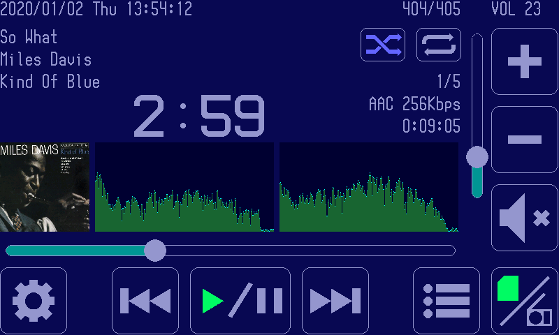

# GadgetSeed Sample Application

## Internet radio/Music player

   It is a music player to operate with a touch panel.

   You can play [shoutcast](https://directory.shoutcast.com/) internet radio.
   M3U, PLS files stored on MicroSD card can be played as a playlist of internet radio. (MP3,128Kbps only)

   You can play MP3 files and AAC files stored on your MicroSD card.

   You can view information about songs, including album art.

   The AAC audio decoder uses [faad2](https://github.com/dsvensson/faad2).

   The MP3 audio decoder uses [libmad](https://www.underbit.com/products/mad/).

   You can view album art in JPEG and PNG formats.

   [picojpeg](https://code.google.com/archive/p/picojpeg/) is used to decode JPEG images.

   PNG image codecs are using [libpng](http://www.libpng.org/pub/png/) and [zlib](https://zlib.net/).

   [mt19937ar](http://www.math.sci.hiroshima-u.ac.jp/m-mat/MT2002/MT2002/mt19937ar.html) is used to generate random numbers for random playback functions.

   Works with 32F769IDISCOVERY, 32F746GDISCOVERY.

   

   The snapshot is of 32F769IDISCOVERY.

   Config files : internetradio_hr.conf, internetradio_lr.conf

   Source File Directory : internetradio, soundplay, musicplay

## File manager

   It is a simple file manager. MP3, You can play AAC files. (32F769IDISCOVERY, 32F746GDISCOVERY only)

   You can view PNG image files. (32F769IDISCOVERY, 32F746GDISCOVERY only)

   You can view JPEG image files.

   Works with 32F769IDISCOVERY, 32F746GDISCOVERY.

   Works with NUCLEO-F411RE + LCD (Kuman 2.8inch TFT LCD Shield).

   Works with NUCLEO-F411RE + LCD (Kuman 3.5inch TFT LCD Shield).

   

   

   The snapshot is of 32F769IDISCOVERY.

   Config file : filemanager_hr.conf, filemanager_lr.conf

   Source File Directory : filemanager, soundplay

## Clock application

   This is an application of digital clock using RTC.

   

   

   The snapshot is of 32F746GDISCOVERY.

   Config file : clock_hr.conf

   Source file directory : clock

## Paint application

   It is a simple drawing software using a touch panel.

   

   The snapshot is of 32F746GDISCOVERY.

   Config file : paint.conf

   Source File Directory : paint

## Graphics test

   Random graphicdrawing test program.

   

   The snapshot is from NUCLEO-F411RE + LCD (Kuman 2.8inch TFT LCD Shield).

   Config file : graphics_test.conf

   Source file directory : graphics_test

## LED brink

   This is an application that flashes the LED.
   Flash the LCD on the board.

   Works with 32F769IDISCOVERY, NUCLEO-F411RE.

   Config File : heartbeat.conf

   Source file directory : heartbeat

## Hello world

   To the debug console"Hello, word!" to the <a0></a0>.

   ```sh
   GadgetSeed Ver. 0.9.5
   (c)2010-2018 Takashi SHUDO
   CPU ARCH     : Cortex-M7
   CPU NAME     : STM32F746NGH6
   SYSTEM       : 32F746GDISCOVERY
   Build date   : 15:52:32 Jul 31 2018
   System Clock : 162 MHz
   : Hello, world!
   ```

   Config file : hello_world.conf

   Source file directory : hello_world

## Network sample

   HTTPSERVER, a sample of LwIP, works. Telnetd also works.
   You can log in with telnet from outside and use the GadgetSeed debug console.

   Works with 32F769IDISCOVERY, 32F746GDISCOVERY.

   Config file : network.conf

   Source file directory : httpserver, telnetd
